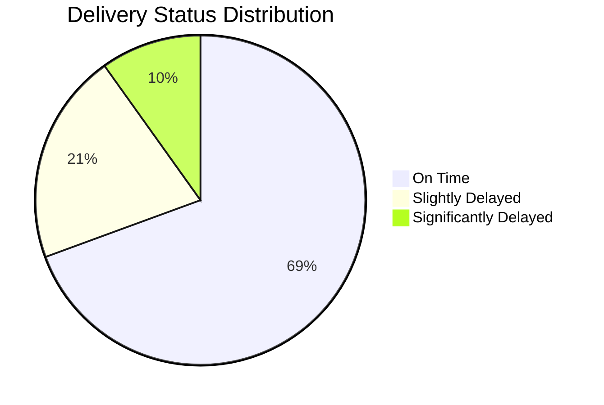
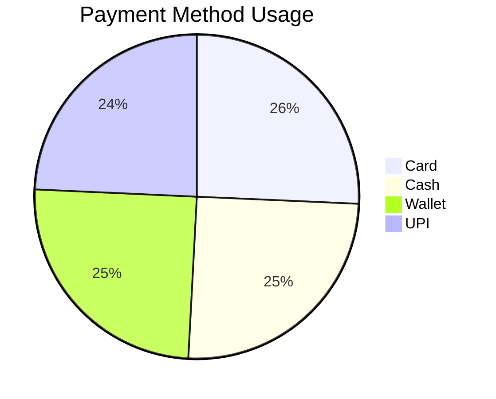
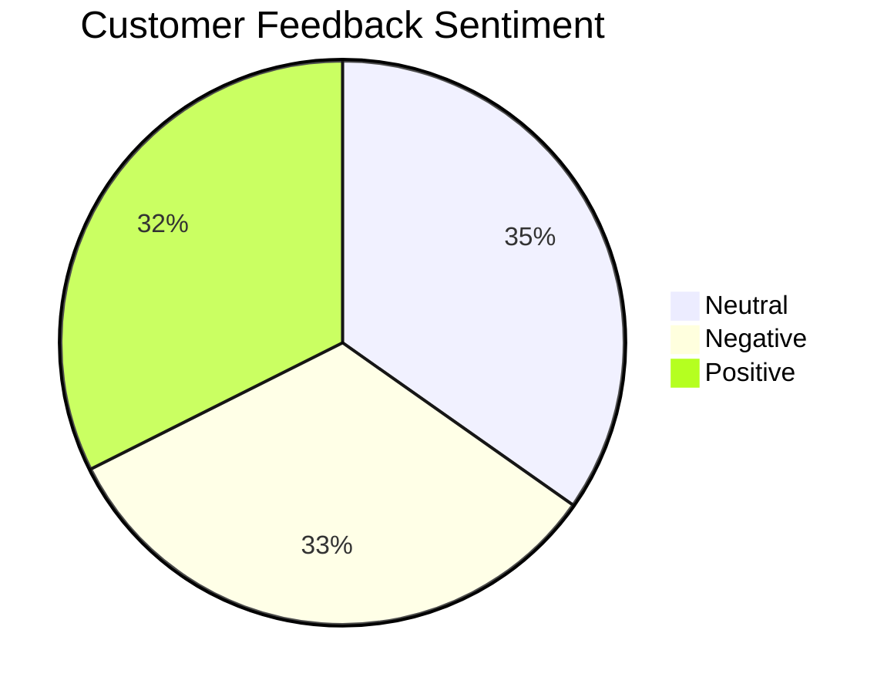
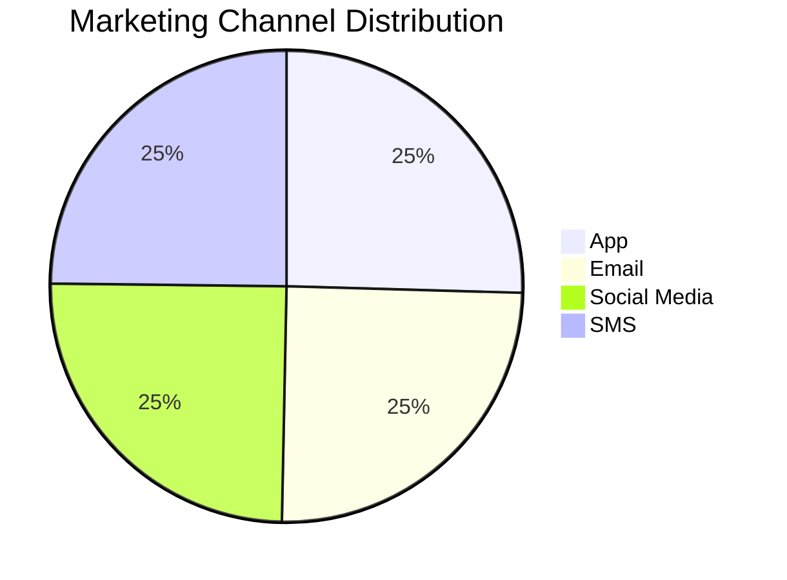

# Blinkit Analytics Dashboard

> A comprehensive retail analytics solution examining Blinkit's operational performance across orders, customers, inventory, delivery, and marketing dimensions using Tableau and structured CSV datasets.


## Overview
This project delivers a comprehensive business analysis of Blinkit, a rapid-commerce platform, by consolidating diverse operational datasets into a unified decision-support dashboard. The goal was to convert raw transactional information into actionable KPIs and business insights enabling monitoring, reporting, and strategic decision-making.

The dashboard focuses on five core business areas:

- Sales performance
- Customer behavior
- Delivery operations
- Inventory quality
- Marketing effectiveness

## Business Problem
Rapid-commerce platforms function in an extremely competitive landscape where order throughput, delivery performance, product availability, and customer experience directly impact profitability. This initiative addresses key business questions including:

- How does revenue trend over time?
- Which products and categories generate the highest sales?
- How dependable are our delivery services?
- What insights do customer ratings and feedback provide?
- Which marketing channels deliver optimal returns?
- Where do inventory quality concerns impact operations?

## Key Metrics

| KPI | Value |
|---|---:|
| Total Orders | 5,000 |
| Total Revenue | INR 11,009,308.50 |
| Average Order Value | INR 2,201.86 |
| Products Analyzed | 268 |
| Marketing Spend | INR 16,319,838.24 |
| Marketing Revenue | INR 32,193,407.37 |
| Average ROAS | 2.74 |
| Average Delivery Time Variance | 4.44 mins |
| Average Delivery Distance | 2.72 km |

## Dashboard Preview
The completed dashboard was developed in Tableau to deliver a concise executive overview of Blinkit's business performance spanning sales, operations, marketing, and customer engagement.

Core dashboard elements include:

- KPI cards for orders, revenue, AOV, and product coverage
- Monthly sales trend analysis
- Top products by revenue
- Customer segment distribution
- Delivery performance monitoring
- Payment mode analysis
- Feedback sentiment analysis
- Rating distribution
- Campaign performance tracking

## Visual Insights

### Delivery Status Mix


### Payment Method Distribution


### Customer Feedback Sentiment


### Marketing Channel Volume


## Dataset Summary
This project leverages 9 CSV datasets covering the timeframe from `2023-03-16` through `2024-11-04`.

| Dataset | Description | Records |
|---|---|---:|
| `blinkit_orders.csv` | Order-level transactions including payment method and delivery status | 5,000 |
| `blinkit_order_items.csv` | Item-level order details with quantity and unit price | 5,000 |
| `blinkit_customers.csv` | Customer information, segment, and order behavior | 2,500 |
| `blinkit_products.csv` | Product catalog with pricing, category, and stock thresholds | 268 |
| `blinkit_delivery_performance.csv` | Delivery timelines, distance, and delay reasons | 5,000 |
| `blinkit_customer_feedback.csv` | Ratings, feedback category, and sentiment | 5,000 |
| `blinkit_marketing_performance.csv` | Campaign performance across channels and audiences | 5,400 |
| `blinkit_inventory.csv` | Inventory receipts and damaged stock records | 75,172 |
| `blinkit_inventoryNew.csv` | Validation inventory dataset used for duplicate checks | 18,105 |

## Data Cleaning and Preparation
The datasets underwent thorough cleaning and standardization before analysis and dashboard creation. The preparation workflow encompassed:

- Normalizing text fields including names, brands, and sentiment classifications
- Standardizing date and timestamp formats across all datasets
- Validating order and delivery status classifications
- Engineering calculated metrics such as total item value, discount percentages, CTR, conversion rates, usable stock, and damage ratios
- Eliminating `7,359` duplicate records from `blinkit_inventoryNew.csv`
- Cross-referencing tables to enhance reporting consistency across orders, customers, products, and campaigns

## Analytical Scope

### 1. Sales Analysis
- Total revenue and order trends
- Average order value analysis
- Top products by revenue contribution
- Product and category performance tracking

### 2. Customer Analysis
- Customer segmentation insights
- Rating and sentiment monitoring
- Feedback category analysis
- Customer spending patterns

### 3. Delivery Analysis
- On-time vs delayed delivery performance
- Delay pattern monitoring
- Delivery time and distance analysis
- Root-cause review of delivery delays

### 4. Inventory Analysis
- Stock received vs damaged stock
- Inventory quality tracking
- Data quality validation
- Product-level stock planning support

### 5. Marketing Analysis
- Spend vs revenue comparison
- ROAS tracking
- Channel performance benchmarking
- Audience-level campaign analysis

## Tools Used
- `Tableau` for dashboard development and data visualization
- `CSV datasets` serving as the primary analytical data sources
- `Data preprocessing and KPI development` for business intelligence reporting

## Repository Structure
```text
Blinkit-Dashboard/
├── Blinkit Dashboard.pdf
├── blinkit_customers.csv
├── blinkit_customer_feedback.csv
├── blinkit_delivery_performance.csv
├── blinkit_inventory.csv
├── blinkit_inventoryNew.csv
├── blinkit_marketing_performance.csv
├── blinkit_order_items.csv
├── blinkit_orders.csv
├── blinkit_products.csv
└── README.md
```

## Resume-Ready Description
Engineered a Blinkit business intelligence solution using Tableau by integrating and analyzing 9 retail datasets encompassing orders, customers, marketing, inventory, and delivery operations. Executed data preprocessing, duplicate elimination, KPI framework design, and insight generation to assess revenue patterns, customer sentiment, campaign ROI, and operational effectiveness.

## Key Differentiators
- Exhibits strong business acumen beyond technical visualization
- Integrates multiple business domains within a unified dashboard
- Employs quantifiable KPIs rather than generic visualizations
- Demonstrates practical data processing and reporting methodologies
- Ideal for data analyst, business analyst, and BI professional portfolios

## Author
Developed and documented as a personal portfolio initiative to demonstrate expertise in dashboarding, business analytics, and data storytelling capabilities.

