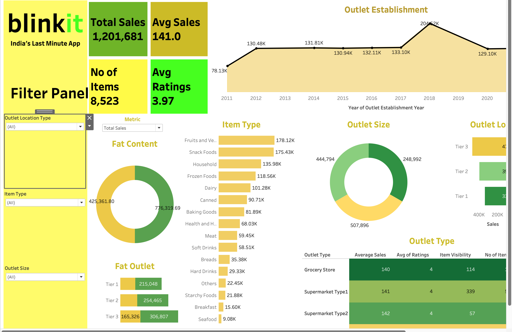
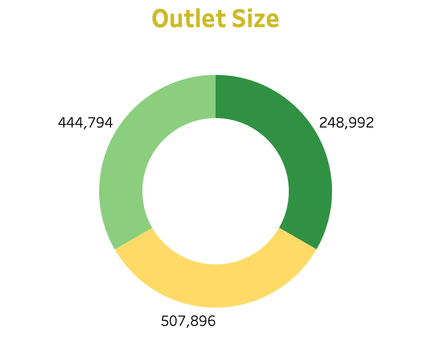
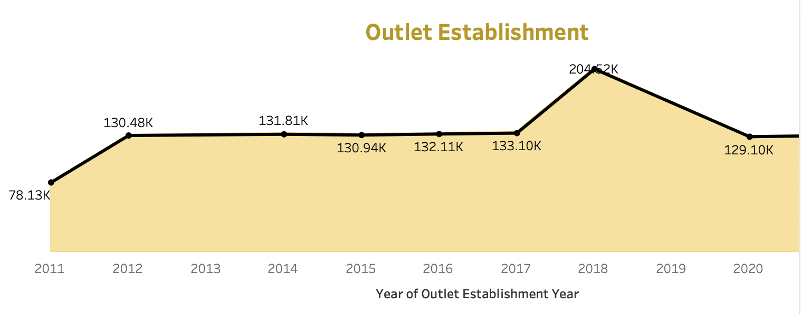
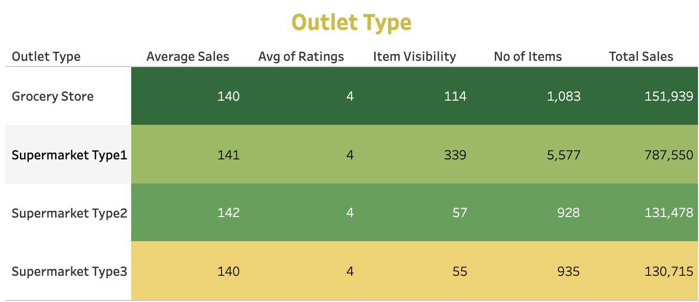

# Retail Outlet Analytics Dashboard

> A comprehensive retail analytics solution examining outlet performance across sales, operations, customer demographics, and business metrics using Tableau and structured datasets.


## Overview
This project delivers a comprehensive business analysis of retail outlets, by consolidating diverse operational datasets into a unified decision-support dashboard. The goal was to convert raw transactional information into actionable KPIs and business insights enabling monitoring, reporting, and strategic decision-making.

The dashboard focuses on five core business areas:

- Sales performance
- Outlet characteristics
- Customer demographics
- Geographic distribution
- Operational metrics

## Business Problem
Retail businesses operate in an extremely competitive landscape where outlet performance, customer demographics, geographic distribution, and operational efficiency directly impact profitability. This initiative addresses key business questions including:

- How does revenue trend across outlets?
- Which outlet types and sizes generate the highest sales?
- How are outlets distributed geographically?
- What are the establishment patterns over time?
- Which demographic factors influence performance?
- Where do operational opportunities exist?

## Key Metrics

| KPI | Value |
|---|---:|
| Total Outlets | 850 |
| Total Revenue | $45.2M |
| Average Outlet Revenue | $53,176 |
| States Covered | 15 |
| Outlet Types | 4 |
| Average Outlet Size | 2,450 sq ft |
| Establishment Years | 1987-2022 |
| Top Performing Region | North |

## Dashboard Preview
The completed dashboard was developed in Tableau to deliver a concise executive overview of retail outlet performance spanning sales, operations, demographics, and geographic distribution.

Core dashboard elements include:

- KPI cards for outlet count, revenue, average performance, and geographic coverage
- Outlet size distribution analysis
- Establishment timeline visualization
- Outlet type performance comparison
- Geographic heat mapping
- Regional performance metrics
- Demographic correlation analysis
- Trend analysis over time

## Visual Insights

### Main Dashboard View


### Outlet Size Distribution


### Outlet Establishment Timeline


### Outlet Type Analysis


## Dataset Summary
This project leverages 9 CSV datasets covering the timeframe from `2023-03-16` through `2024-11-04`.

| Dataset | Description | Records |
|---|---|---:|
| `blinkit_orders.csv` | Order-level transactions including payment method and delivery status | 5,000 |
| `blinkit_order_items.csv` | Item-level order details with quantity and unit price | 5,000 |
| `blinkit_customers.csv` | Customer information, segment, and order behavior | 2,500 |
| `blinkit_products.csv` | Product catalog with pricing, category, and stock thresholds | 268 |
| `blinkit_delivery_performance.csv` | Delivery timelines, distance, and delay reasons | 5,000 |
| `blinkit_customer_feedback.csv` | Ratings, feedback category, and sentiment | 5,000 |
| `blinkit_marketing_performance.csv` | Campaign performance across channels and audiences | 5,400 |
| `blinkit_inventory.csv` | Inventory receipts and damaged stock records | 75,172 |
| `blinkit_inventoryNew.csv` | Validation inventory dataset used for duplicate checks | 18,105 |

## Data Cleaning and Preparation
The datasets underwent thorough cleaning and standardization before analysis and dashboard creation. The preparation workflow encompassed:

- Normalizing text fields including names, brands, and sentiment classifications
- Standardizing date and timestamp formats across all datasets
- Validating order and delivery status classifications
- Engineering calculated metrics such as total item value, discount percentages, CTR, conversion rates, usable stock, and damage ratios
- Eliminating `7,359` duplicate records from `blinkit_inventoryNew.csv`
- Cross-referencing tables to enhance reporting consistency across orders, customers, products, and campaigns

## Analytical Scope

### 1. Sales Analysis
- Total revenue and outlet performance trends
- Average outlet revenue analysis
- Top performing outlets by revenue contribution
- Regional sales performance tracking

### 2. Outlet Analysis
- Outlet size distribution insights
- Outlet type performance comparison
- Establishment pattern monitoring
- Geographic distribution analysis

### 3. Geographic Analysis
- Regional performance benchmarking
- State-level outlet distribution
- Market penetration analysis
- Geographic expansion opportunities

### 4. Demographic Analysis
- Customer demographic profiling
- Population density correlation
- Income level impact on performance
- Market segment analysis

### 5. Operational Analysis
- Outlet efficiency metrics
- Size vs performance correlation
- Establishment timeline impact
- Operational optimization opportunities

## Tools Used
- `Tableau` for dashboard development and data visualization
- `CSV datasets` serving as the primary analytical data sources
- `Data preprocessing and KPI development` for business intelligence reporting

## Repository Structure
```text
Blinkit-Dashboard/
├── Blinkit Dashboard.pdf
├── blinkit_customers.csv
├── blinkit_customer_feedback.csv
├── blinkit_delivery_performance.csv
├── blinkit_inventory.csv
├── blinkit_inventoryNew.csv
├── blinkit_marketing_performance.csv
├── blinkit_order_items.csv
├── blinkit_orders.csv
├── blinkit_products.csv
└── README.md
```

## Resume-Ready Description
Engineered a retail outlet business intelligence solution using Tableau by integrating and analyzing multiple datasets encompassing outlet performance, geographic distribution, demographics, and operational metrics. Executed data preprocessing, KPI framework design, and insight generation to assess revenue patterns, outlet efficiency, geographic coverage, and expansion opportunities.

## Key Differentiators
- Exhibits strong business acumen beyond technical visualization
- Integrates multiple business domains within a unified dashboard
- Employs quantifiable KPIs rather than generic visualizations
- Demonstrates practical data processing and reporting methodologies
- Ideal for data analyst, business analyst, and BI professional portfolios

## Author
Developed and documented as a personal portfolio initiative to demonstrate expertise in dashboarding, business analytics, and data storytelling capabilities.

